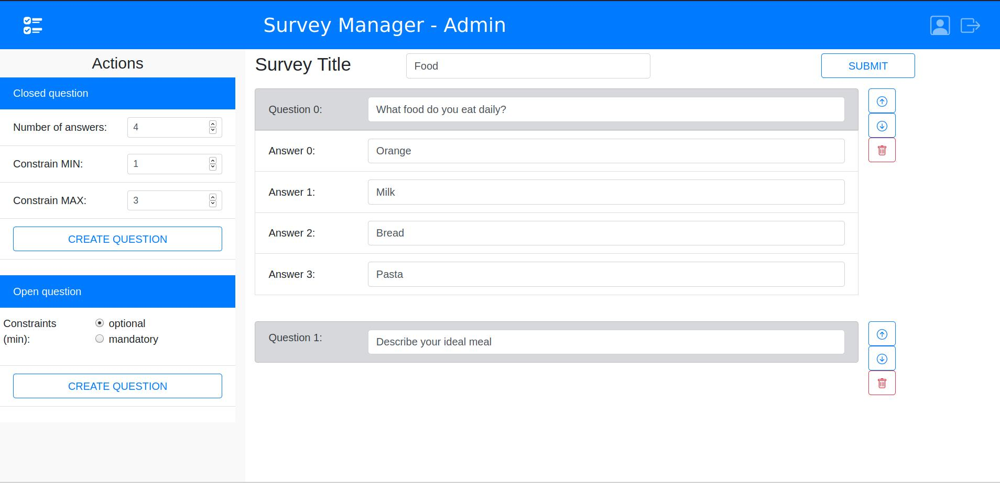

# Exam #1: "Survey"
## Student: s283478 CELADA PAOLO

## React Client Application Routes

- Route `/`: main user page, where the user can submit a response to a survey
- Route `/login`: login page, used by admin to access routes used to create surveys or view responses
- Route `/admin`: main admin page, where the admin can view each surveys responses from different users
- Route `/admin/create`: page where a logged in admin can create a new survey and submit it into the system

## API Server

### Login

* **POST**: `/api/login`
* **Description**: login a user into the system
* **Request**: POST /api/login<br/>
  **Request body**: A JSON object representing the user credentials (Content-Type: `application/json`)
```
{
    "username": "email@polito.it",
    "password": "password"
}
```
* **Response**: `200 Valid Access` (success)<br/>
  **Response body**: *none*
* **Error response**: `500 Internal Server Error` (generic error)<br/>
`401 Unprocessable entity` (validation error)

### Retrieve all available surveys

* **GET**: `/api/surveys`
* **Description**: Retrieve all available surveys - called for a regular user
* **Request**: GET /api/surveys <br/>
  **Request body**: *none*
* **Response**: `200 OK` (success) - Return an array of JSON object representing each survey <br/>
  **Response body**:
```
[{
  "Id": 1,
  "Title": "Mood",
  "NumberQuestions": 2,
  "QuestionsAndAnswers": [{
    "answers": ["Good", "Tired", "Bored"],
    "max": 1,
    "min": 0,
    "numAnswers": 3,
    "question": "How are you?"
  }, {
    "answers": [""],
    "max": -1,
    "min": 0,
    "question": "Describe your day?"
  }]
}, {
  "Id": 2,
  "Title": "Interest",
  "NumberQuestions": 2,
  "QuestionsAndAnswers": [{
    "question": "Your favourite sport? (select 2)",
    "answers": ["Golf", "Basketball", "Soccer", "Others..."],
    "numAnswers": 4,
    "min": 0,
    "max": 3
  }, {
    "question": "Tell me a story",
    "answers": [""],
    "min": 1,
    "max": -1
  }]
}]
```
* **Error response**: `500 Internal Server Error` (generic error)

### Retrieve surveys created by the admin calling the api

* **GET**: `/api/surveysAdmin`
* **Description**: Retrieve all surveys created by the admin who called the api
* **Request**: GET /api/surveysAdmin <br/>
  **Request body**: *none*
* **Response**: `200 OK` (success) - Return an array of JSON object representing each survey <br/>
  **Response body**:
```
  [{
  "Id": 1,
  "Title": "Mood",
  "NumberQuestions": 2,
  "QuestionsAndAnswers": [{
    "answers": ["Good", "Tired", "Bored"],
    "max": 1,
    "min": 0,
    "numAnswers": 3,
    "question": "How are you?"
  }, {
    "answers": [""],
    "max": -1,
    "min": 0,
    "question": "Describe your day?"
  }]
}, {
  "Id": 2,
  "Title": "Interest",
  "NumberQuestions": 2,
  "QuestionsAndAnswers": [{
    "question": "Your favourite sport? (select 2)",
    "answers": ["Golf", "Basketball", "Soccer", "Others..."],
    "numAnswers": 4,
    "min": 0,
    "max": 3
  }, {
    "question": "Tell me a story",
    "answers": [""],
    "min": 1,
    "max": -1
  }]
}]
```
* **Error response**: `500 Internal Server Error` (generic error)

### get responses for a given survey

* **GET**: `/api/surveys/<surveyId>`
* **Description**: get responses for a given survey (identified with surveyId <surveyId>)
* **Request**: GET /api/surveys/< surveyId><br/>
  **Request body**:*none*

* **Response**: `200 OK` (success)<br/>
  **Response body**:  A JSON object representing the responses to a given survey (Content-Type: `application/json`)
```
[
  {
    "Id": 7,
    "SurveyId": 3,
    "Username": "Paolo",
    "Response": [
      "my name is paolo",
      [
        true,
        false,
        false
      ],
      [
        false,
        true,
        false,
        true,
        false
      ]
    ],
    "AdminId": 2
  },
  {
    "Id": 8,
    "SurveyId": 3,
    "Username": "Luca",
    "Response": [
      "my name is luca",
      [
        false,
        false,
        true
      ],
      [
        false,
        false,
        true,
        false,
        false
      ]
    ],
    "AdminId": 2
  }
]
```
* **Error response**: `500 Internal Server Error` (generic error)<br/>
`404 Unprocessable entity` (validation error)<br/>
`401 Anauthorized` (authorization error)

### Submit new response to a survey

* **POST**: `/api/surveys/<surveyId>`
* **Description**: submit a new response for a given survey (identified with surveyId <surveyId>)
* **Request**: POST /api/surveys/< surveyId><br/>
  **Request body**: A JSON object representing the response (Content-Type: `application/json`)
```
{
  "surveyId": 21,
  "username": "Max",
  "response": [
    [
      false,
      true,
      false
    ]
  ]
}
```
* **Response**: `200 Created` (success)<br/>
  **Response body**: *none*
* **Error response**: `500 Internal Server Error` (generic error)

### Create new survey

* **POST**: `/api/surveys`
* **Description**: Create and add a single survey (passed) to the list of surveys
* **Request**: POST /api/surveys<br/>
  **Request body**: A JSON object representing the survey (Content-Type: `application/json`)
```
{
  "title": "Holiday",
  "questionsAndAnswers": [
    {
      "question": "Where do you prefer to spend your summer vacations?",
      "answers": [
        "Sea",
        "Mountains",
        "Others..."
      ],
      "numberAnswers": "3",
      "min": "1",
      "max": "1"
    },
    {
      "question": "Describe your last summer vacation",
      "answers": [
        ""
      ],
      "min": 1,
      "max": -1
    }
  ]
}
```
* **Response**: `200 Created` (success)<br/>
  **Response body**: *none*
* **Error response**: `500 Internal Server Error` (generic error)


## Database Tables

- Table `Admin` - contains (Id, Email, hash): represent each admin registered into the system through its credentials
- Table `Surveys` - contains (Id, Title, AdminId, NumberQuestions, QuestionsAndAnswers, NumberResponses): represent a survey into the system, with related informations; each question with the related answers is represented into the *QuestionsAndAnswers* field containing a JSON string
- Table `Responses` - contains (Id, SurveyId, Username, Response): represent responses to a survey by a certain user (represented by a username only); the list of responses to the survey is represented through a list saved as a string into the *Response* field

## Main React Components

- `App` (in `App.js`): represent the root of the whole application; it declares *useState* used by different components, routes of the application, and *useEffect* to load data from the server depending on the route; it handles also login/logout functionalities with the server
- `NavBar` (in `NavBar.js`): represent the navigation bar component present in each page (in the top part), with app title, symbol and login/logout buttons
- `LoginForm` (in `LoginComponent.js`): represent the component user in the route `/login` in order to allow an admin to login into the system
- `LeftSide` (in `LeftSide.js`): represent the left side bar present in the main user and admin pages; it allows to switch between different surveys, by displaying their names; the user is allowed to see all available surveys, while the admin only the ones created by him/her
- `SurveyRow` (in `LeftSide.js`): implement each row of the list of surveys in the *LeftSide* component, by giving to each of them the right properties and handling *onClick* functionality
- `RightSide` (in `RightSide.js`): represent the right side of the main user page (*/*), and it's composed of a username field and a series of open/closed questions; it gives the user the possibility to submit a response to a certain survey, handling errors properly
- `OpenQuestion` (in `RightSide.js`): represent a open question to be shown to the user, with a question title and a text field, plus all question's constraints
- `ClosedQuestion` (in `RightSide.js`): represent a closed question to be shown to the user, with a question title and a list of possible answers, plus all question's constraints
- `RightSideAdmin` (in `RightSideAdmin.js`): represent the right side of the main admin page (*/admin*), and it's composed of all responses to a survey by a given user; the admin have the possibility by using to separate arrows to navigate through all responses given to the survey by different users
- `OpenQuestion` (in `RightSideAdmin.js`): represent a single open question to be shown in read-only mode to the admin with user responses
- `ClosedQuestion` (in `RightSideAdmin.js`): represent a single closed question to be shown in read-only mode to the admin with user responses
- `CreateSurvey` (in `CreateSurvey.js`): represent the whole page component used by admin to create a survey after loggin in and navigating to */admin/create*; it's divided again in left side and right side, and it allows the admin to add new questions to the survey, modifying the order of questions, delete questions and submit the survey; once submitted, the survey cannot be modified and it's available to all users
- `CreateRightSide` (in `RightSide.js`): represent the right side of the page, where new added questions are shown and where admin can write the questions and possible answers, and give a title to it; lastly, the admin can submit the survey
- `CreateLeftSide` (in `RightSide.js`): represent the left side bar where the admin can add open or closed questions to the survey, by inserting number of answers and question constraints

## Screenshot



## Users Credentials

- email@polito.it, password (surveys created: Mood, Interest)
- 1234@polito.it, password (surveys created: Personality, Movies)
