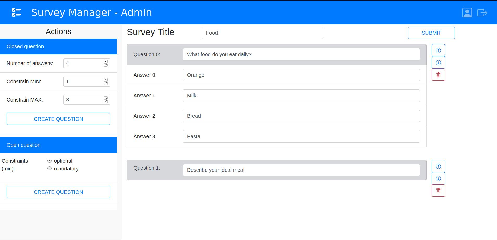

# Exam #1: "Survey"
## Student: s283478 CELADA PAOLO 

## React Client Application Routes

- Route `/`: page content and purpose
- Route `/something/:param`: page content and purpose, param specification
- ...

## API Server

### Login

* **POST**: `/api/login`
* **Description**: login a user into the system
* **Request**: POST /api/login<br/>
  **Request body**: A JSON object representing the user credentials (Content-Type: `application/json`)
```
{
    "username": "email@polito.it",
    "password": "password"
}
```
* **Response**: `200 Valid Access` (success)<br/>
  **Response body**: *none*
* **Error response**: `500 Internal Server Error` (generic error)<br/>
`422 Unprocessable entity` (validation error)

### Retrieve all available surveys

* **GET**: `/api/surveys`
* **Description**: Retrieve all available surveys - called for a regular user
* **Request**: GET /api/surveys <br/>
  **Request body**: *none*
* **Response**: `200 OK` (success) - Return an array of JSON object representing each survey <br/>
  **Response body**:
```
  {
    title: "Mood",
    questions: [
      {
        question: "How are you?",
        answers: ["Good", "Tired", "Bored"],
        numAnswers: 3,
        min: 0,
        max: 1,
      },
      {
        question: "Describe your day?",
        answers: [""],
        min: 0,
        max: -1,
      }
    ],
  },
  {
    title: "Interest",
    questions: [
      {
        question: "Your favourite sport? (select 2)",
        answers: ["Golf", "Basketball", "Soccer", "Others..."],
        numAnswers: 4,
        min: 0,
        max: 3,
      },
      {
        question: "Tell me a story",
        answers: [""],
        min: 1,
        max: -1,
      }
    ]
  } 
```
* **Error response**: `500 Internal Server Error` (generic error)

### Retrieve surveys created by the admin calling the api

* **GET**: `/api/surveysAdmin`
* **Description**: Retrieve all surveys created by the admin who called the api
* **Request**: GET /api/surveysAdmin <br/>
  **Request body**: *none*
* **Response**: `200 OK` (success) - Return an array of JSON object representing each survey <br/>
  **Response body**:
```
  {
    title: "Mood",
    questions: [
      {
        question: "How are you?",
        answers: ["Good", "Tired", "Bored"],
        numAnswers: 3,
        min: 0,
        max: 1,
      },
      {
        question: "Describe your day?",
        answers: [""],
        min: 0,
        max: -1,
      }
    ],
  },
  {
    title: "Interest",
    questions: [
      {
        question: "Your favourite sport? (select 2)",
        answers: ["Golf", "Basketball", "Soccer", "Others..."],
        numAnswers: 4,
        min: 0,
        max: 3,
      },
      {
        question: "Tell me a story",
        answers: [""],
        min: 1,
        max: -1,
      }
    ]
  } 
```
* **Error response**: `500 Internal Server Error` (generic error)

### get responses for a given survey

* **GET**: `/api/surveys/<surveyId>`
* **Description**: get responses for a given survey (identified with surveyId <surveyId>)
* **Request**: GET /api/surveys/< surveyId><br/>
  **Request body**:*none*

* **Response**: `200 Updated` (success)<br/>
  **Response body**:  A JSON object representing the responses to a given survey (Content-Type: `application/json`)
  ```
{
    users: ["paolo", "luca", "laura"],
    questions: [
      {
        responses: [
          [0, 1, 0],
          [0, 0, 1],
          [1, 0, 0]
        ]
      },
      {
        responses: [
          ["nothing to do"],
          ["study all day"],
          ["crazy"]
        ]
      }
    ]
}
```
* **Error response**: `500 Internal Server Error` (generic error)<br/>
`422 Unprocessable entity` (validation error)

### Submit new answer to a survey

* **POST**: `/api/surveys/<surveyId>`
* **Description**: submit a new answer for a given survey (identified with surveyId <surveyId>)
* **Request**: POST /api/surveys/< surveyId><br/>
  **Request body**: A JSON object representing the answer (Content-Type: `application/json`)
```
{
    user: "paolo",
    responses: [
      [0, 1, 0],
      "Nothing to do"
    ]
}
```
* **Response**: `200 Created` (success)<br/>
  **Response body**: *none*
* **Error response**: `500 Internal Server Error` (generic error)<br/>
`422 Unprocessable entity` (validation error)

### Create new survey

* **POST**: `/api/surveys`
* **Description**: Create and add a single survey (passed) to the list of surveys
* **Request**: POST /api/surveys<br/>
  **Request body**: A JSON object representing the survey (Content-Type: `application/json`)
```
{
    title: "Mood",
    questions: [
      {
        question: "How are you?",
        answers: ["Good", "Tired", "Bored"],
        numAnswers: 3,
        min: 0,
        max: 1,
      },
      {
        question: "Describe your day?",
        answers: [""],
        min: 0,
        max: -1,
      }
    ],
  },
  {
    title: "Interest",
    questions: [
      {
        question: "Your favourite sport? (select 2)",
        answers: ["Golf", "Basketball", "Soccer", "Others..."],
        numAnswers: 4,
        min: 0,
        max: 3,
      },
      {
        question: "Tell me a story",
        answers: [""],
        min: 1,
        max: -1,
      }
    ]
  } 
```
* **Response**: `200 Created` (success)<br/>
  **Response body**: *none*
* **Error response**: `500 Internal Server Error` (generic error)<br/>
`422 Unprocessable entity` (validation error)


## Database Tables

- Table `users` - contains xx yy zz
- Table `something` - contains ww qq ss
- ...

## Main React Components

- `ListOfSomething` (in `List.js`): component purpose and main functionality
- `GreatButton` (in `GreatButton.js`): component purpose and main functionality
- ...

(only _main_ components, minor ones may be skipped)

## Screenshot



## Users Credentials

- username, password (plus any other requested info)
- username, password (plus any other requested info)
